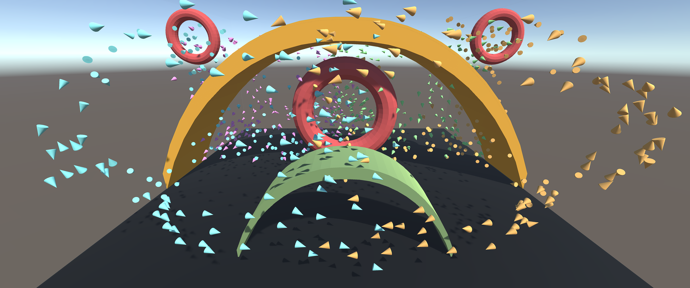
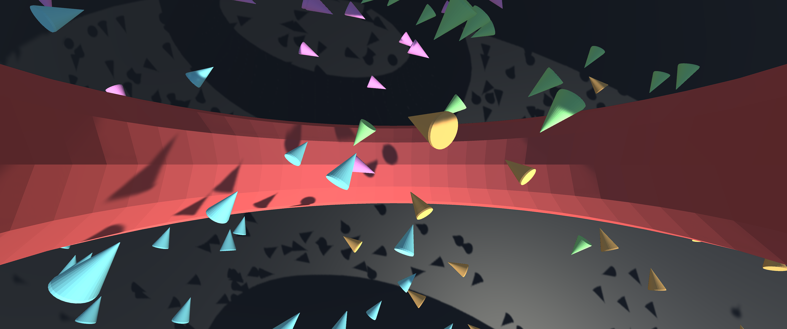
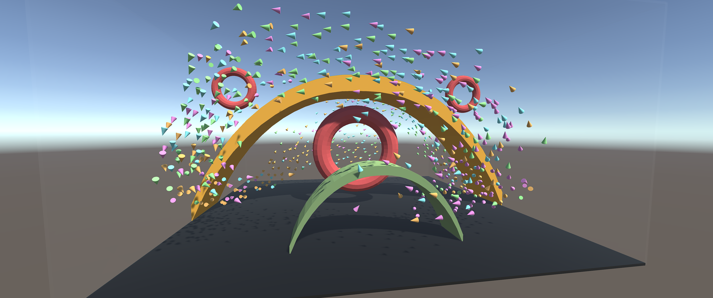

# Boids

This is heavily based on the code from Sebastion Lague!
See <https://youtu.be/bqtqltqcQhw>

Usage:

- [leftclick] camera movement
- [rightclick] camera zoom
- [arrow up/down] move center up and down
- [arrow left/right] rotate 90 deg left/right
- [d] default view
- [t] top down view
- [r] reseting the simulation
- [Spacebar] pausing the simulation

